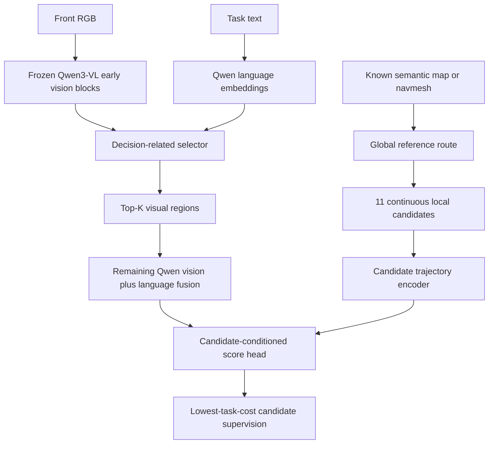

# V8.2: known-map planning with nuPlan, PointNav and Qwen3-VL

V8.2 replaces the synthetic fixed path classes with a common candidate-
trajectory planning task. It keeps the frozen Qwen3-VL-8B backbone, the
decision-related latent selector and decision-gradient distillation (DGD).
There is **no Flow Matching and no neurodynamic (ND) module** in this version.

## 1. What the two sources actually provide

- **nuPlan**: logged autonomous-driving sensors, ego/agent tracks, semantic HD
  maps and an official closed-loop planning simulator/metric suite.
- **PointNav-VO** is a paper/repository, not a new dataset. Its experiments use
  Habitat PointNav episodes and Gibson scenes. RGB-D visual odometry updates
  the local PointGoal when GPS+Compass is unavailable.

Use separate environments for export because nuPlan and the published
PointNav-VO code pin very different dependency versions. Export both sources
to the portable V8.2 NPZ schema, then train Qwen in the existing modern
environment.

## 2. Planning pipeline



The known map is used explicitly by the classical/global planning side to
generate a route and feasible candidates. There is no hidden `graph_feat` in
the student. The student sees only deployable inputs:

1. front RGB;
2. task instruction;
3. 11 ego-frame candidate trajectories;
4. goal state `[dx, dy, distance, bearing]`;
5. an 8-D ego-motion state;
6. source ID (nuPlan or PointNav).

Teacher-only fields are candidate validity, candidate task costs and the
optimal index. They are read by the loss, never by the model forward method.

## 3. Common NPZ schema

| Field | Shape | Online input? | Meaning |
|---|---:|:---:|---|
| `image` | `H,W,3` | yes | front RGB |
| `task_text` | scalar string | yes | planning instruction |
| `source_id` | scalar | yes | 0=nuPlan, 1=PointNav |
| `candidate_trajectories` | `11,16,3` | yes | x-forward, y-left, yaw |
| `candidate_features` | `11,8` | yes | geometry derived from candidates |
| `goal_state` | `4` | yes | relative goal |
| `ego_state` | `8` | yes | current observable motion state |
| `candidate_valid` | `11` | loss/mask | feasible candidate mask |
| `candidate_costs` | `11` | loss only | downstream task cost |
| `optimal_path_idx` | scalar | loss only | minimum-cost label |

`mapped_planning_schema_v82.py` constructs continuous Frenet-style candidates
around a reference route. `planning_adapters_v82.py` converts simulator metric
components to the common sample. Do not use random train/validation frame
splits: split nuPlan by log/scenario and PointNav by Gibson scene to prevent
near-duplicate leakage.

## 4. nuPlan export

For each selected scenario iteration:

1. read the front camera frame (`CAM_F0`) from the sensor blob;
2. query the HD-map route and express a local route in the current ego frame;
3. create 11 laterally varied, spatially continuous candidates;
4. roll each candidate through the nuPlan observation/controller/metric path;
5. convert official safety/progress/comfort measures to lower-is-better
   penalties;
6. call `export_nuplan_sample(...)`.

Suggested cost is

\[
C(\tau)=20C_{collision}+10C_{offroad}+5C_{wrongway}
+3C_{TTC}+2C_{route}+C_{progress}+0.2C_{comfort}.
\]

The weights are experiment configuration, not a claim that one official score
has this exact formula. Store individual components during export so the
weights can be ablated later.

Important limitation: nuPlan can return the real camera image at a logged
iteration, but a closed-loop ego deviation does not create a new photorealistic
camera frame. Therefore train RGB selection with log replay/open-loop samples,
and use the official closed-loop simulator for trajectory metrics. If fully
state-dependent closed-loop visual observations are required, use simulator
rendering or a map/agent raster rather than pretending a logged image changes.

## 5. PointNav-Gibson export

For each Habitat episode step:

1. use the current RGB observation (depth is reserved for VO, not required as
   a Qwen input in this baseline);
2. use the known navmesh to get the global shortest-path reference;
3. update the local PointGoal using the PointNav-VO relative-pose estimate;
4. express the route and candidates in the current estimated ego frame;
5. simulate each candidate/action rollout on the navmesh;
6. form costs from collision, remaining geodesic distance, path length and
   goal miss, then call `export_pointnav_sample(...)`.

Keep both variants for the ablation: oracle pose vs VO pose. Report Success and
SPL, plus candidate-cost regret. This separates token selection errors from VO
localization errors.

## 6. Model and loss

Qwen3-VL already supplies pretrained image-language alignment. V8.2 does not
retrain an ITC/ITM pretraining objective. The selector learns task-specific
alignment by cross-attending Qwen visual regions to Qwen text embeddings.

For candidate logits \(s_i\), costs \(c_i\), valid set \(V\), and normalized
cost \(\bar c_i\), the task distribution and primary regret are

\[
p_i=\operatorname{softmax}_{i\in V}(s_i),\qquad
L_{task}=\sum_{i\in V}p_i\bar c_i.
\]

The trainer also uses a soft cost-policy KL and optimal-candidate CE. DGD takes
the actual downstream gradient \(-\partial L/\partial m_j\) with respect to
each visual-region mask, projects it onto the fixed-K plane, detaches it, and
teaches selector scores to match it. It does not optimize model structure.

Training uses a straight-through mask: hard Top-K values in the forward pass
and soft fixed-budget derivatives in the backward pass. Validation physically
removes unselected region groups before the remaining Qwen vision blocks and
the LLM.

## 7. Commands

Run the schema test:

```bash
cd /home/lyi/neurodynamic/dcv_v74_decision_value_bottleneck
python test_v82_mapped_planning.py
```

Train after exporting train/val folders:

```bash
TRAIN_DATA=/data/lyi/v82/train \
VAL_DATA=/data/lyi/v82/val \
VLM_MODEL=/data/lyi/models/Qwen3-VL-8B-Instruct \
DEVICE=1 BUDGET=0.15 EPOCHS=30 BATCH_SIZE=1 \
bash run_v82.sh /home/lyi/neurodynamic/dcv_v74_decision_value_bottleneck
```

Recommended two-stage start:

1. head warm-up with `BUDGET=1.0` and append `--lambda-dgd 0` after the script
   path;
2. resume that checkpoint with the target budget (for example 0.15) and DGD.

The training script accepts `--resume CHECKPOINT`. Keep Flow Matching and ND
off until this baseline beats random-token and full-token controls on both
datasets; otherwise extra dynamics obscure whether the decision-related latent
is working.
